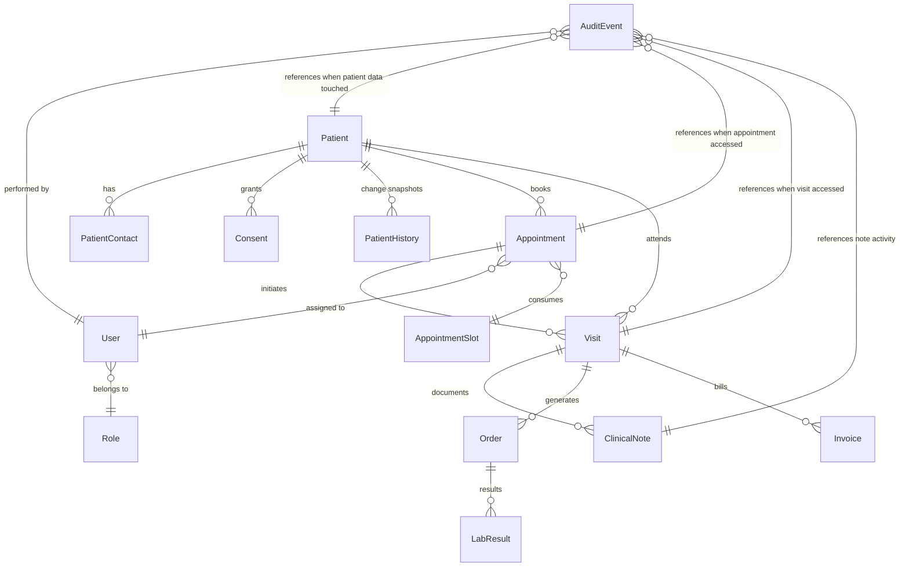
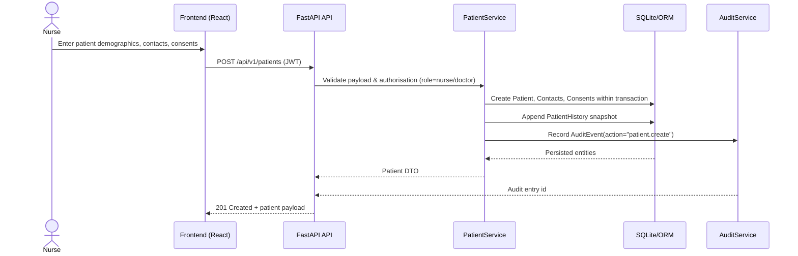
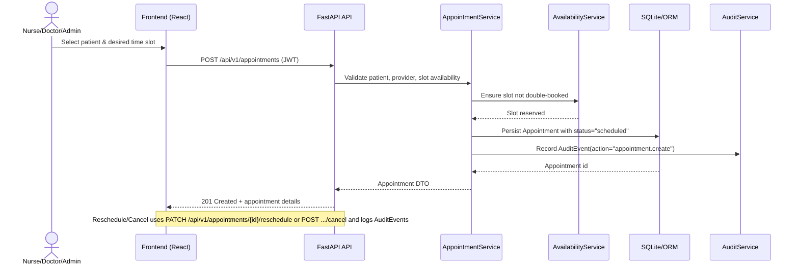

# Architecture Overview

This document summarizes the initial architecture for the Patient Information System MVP using the CSV specification (`specs/patient_system_requirements.csv`) as the single source of truth.

## Requirement Context

Functional focus areas and their key requirements:

- **Patient registration and maintenance** — `F-REG`
  - `REQ-F-REG-001` Potilaan perustietojen rekisteröinti
  - `REQ-F-REG-002` Potilaan tietojen muokkaus ja historiat
  - `REQ-F-REG-003` Suostumusten hallinta
  - `REQ-F-REG-004` Yhteyshenkilöt ja alaikäisen huoltajat
  - `REQ-F-REG-005` Potilaan poistaminen ja arkistointi
- **Appointment management** — `F-APPT`
  - `REQ-F-APPT-001` Ajanvaraus kalenterista
  - `REQ-F-APPT-003` Peruutukset ja uudelleenajoitus
- **Administration and access control** — `F-ADMIN`
  - `REQ-F-ADM-001` Roolit ja oikeudet
  - `REQ-F-ADM-004` Diagnoosikoodien hallinta CSV-tuonnilla
- **Security and audit trail** — `F-SEC`, `F-LEGAL`
  - `REQ-NF-SEC-001` Käyttäjätunnistus ja istunnot
  - `REQ-NF-SEC-002` Käyttöoikeusrajaukset tietotasolla
  - `REQ-NF-SEC-003` Lokitus ja auditointi
  - `REQ-NF-LEGAL-001` Tietosuojaperiaatteet ja minimointi
  - `REQ-NF-LEGAL-002` Oikeus tulla unohdetuksi (arkistointi)
- **Technical baseline** — `F-ARCH`
  - `REQ-NF-ARCH-001` Teknologiapino – kevyt paikallisasennus
  - `REQ-NF-ARCH-004` Tietomalli ja skeemat

## Component Architecture

The solution is split into independently testable layers to keep the system lightweight and locally runnable.

- **Frontend (React + Vite + TypeScript + Tailwind)**: Implements role-specific UI flows for patient registration, appointment scheduling, audit review, and authentication. Communicates exclusively through the REST API.
- **Backend API (FastAPI + SQLModel)**: Hosts the HTTP interface, request validation, and OpenAPI metadata. Routes delegate to service layer functions.
- **Service Layer**: Encapsulates domain logic such as patient lifecycle management, appointment rules (reschedule, cancel), audit creation, and permission checks.
- **Persistence Layer (SQLite via SQLModel/SQLAlchemy + Alembic)**: Defines ORM models, manages schema migrations, and provides repository-style abstractions to the service layer.
- **Auth & Security Module**: Manages user accounts, password hashing, JWT creation/refresh (`REQ-NF-SEC-001`), and role-based authorization (`REQ-NF-SEC-002`).
- **Audit Logging Module**: Records every read or mutation of patient-related entities (`REQ-NF-SEC-003`) and exposes filters for compliance review. Stores immutable AuditEvent rows linked to the resource and actor.
- **Audit Metadata Policy**: `app.services.audit_policy` centralises the allow-list for audit metadata keys and enforces hashing of personal identifiers with a secret salt. `patient_ref`, `identifier_token`, `source_patient_ref`, and other domain-specific keys provide opaque references while preventing raw hetu values from being persisted (`REQ-NF-LEGAL-001`).
- **Background Tasks (optional)**: Lightweight scheduler for cleanup (e.g., archiving), kept minimal to preserve local deployability (`REQ-NF-ARCH-001`).

### Deployment Topology

All components run on a single workstation. The backend exposes HTTP on `localhost`, the frontend runs in a separate dev server during development, and both share the SQLite database file. No external dependencies are required to satisfy `REQ-NF-ARCH-001`.

## Domain Model

### Entities

| Entity | Key Attributes | Description |
| --- | --- | --- |
| Patient | `id`, `identifier`, `first_name`, `last_name`, `date_of_birth`, `sex`, `contact_info`, `status`, timestamps | Core patient record covering requirements `REQ-F-REG-001` and `REQ-F-REG-002`.
| PatientContact | `id`, `patient_id`, `name`, `relationship`, `phone`, `email`, `is_guardian` | Emergency contacts and guardians (`REQ-F-REG-004`).
| Consent | `id`, `patient_id`, `type`, `status`, `granted_at`, `revoked_at`, `notes` | Captures patient consents and their history (`REQ-F-REG-003`).
| PatientHistory | `id`, `patient_id`, `changed_by`, `change_type`, `snapshot`, `changed_at` | Immutable change log for patient updates to meet audit and history expectations (`REQ-F-REG-002`, `REQ-NF-SEC-003`).
| Appointment | `id`, `patient_id`, `provider_id`, `location`, `service_type`, `start_time`, `end_time`, `status`, `notes`, `created_by` | Satisfies scheduling and rescheduling requirements (`REQ-F-APPT-001`, `REQ-F-APPT-003`). |
| Visit | `id`, `patient_id`, `appointment_id`, `visit_type`, `status`, `reason`, `location`, `started_at`, `ended_at`, `attending_provider_id` | Clinical encounter linked to an appointment when applicable and used to aggregate downstream clinical documentation. |
| ClinicalNote | `id`, `visit_id`, `patient_id`, `author_id`, `note_type`, `title`, `content` | Progress notes and encounter narratives captured during a visit. |
| Order | `id`, `visit_id`, `patient_id`, `ordered_by_id`, `order_type`, `status`, `details`, `placed_at` | Medication, lab, or procedure orders initiated from a visit. |
| LabResult | `id`, `order_id`, `result_type`, `status`, `value`, `unit`, `reference_range`, `observed_at`, `metadata` | Structured observations generated from fulfilled orders. |
| Invoice | `id`, `patient_id`, `visit_id`, `total_amount`, `currency`, `status`, `issued_at`, `due_at`, `metadata` | Billing artifact summarising visit charges for revenue tracking. |
| AppointmentSlot | `id`, `provider_id`, `start_time`, `end_time`, `capacity`, `status` | Optional representation of bookable time slots for resource management. |
| User | `id`, `username`, `password_hash`, `display_name`, `role_id`, `is_active` | Clinical or admin users (`REQ-F-ADM-001`).
| Role | `id`, `code`, `name`, `permissions` | Role definitions for doctor, nurse, admin.
| AuditEvent | `id`, `actor_id`, `action`, `resource_type`, `resource_id`, `timestamp`, `metadata`, `context` | Captures every read/write of patient data (`REQ-NF-SEC-003`).
| TokenBlacklist (optional) | `id`, `jti`, `expires_at` | Allows future revocation of refresh tokens if required.
| DiagnosisCode | `id`, `code`, `version`, `short_label`, `long_label`, `chapter`, `effective_from`, `effective_to`, `is_deleted`, timestamps | Lookup table for ICD/ICPC-style diagnosis codes maintained via CSV import. Codes remain immutable identifiers while label changes or end-of-life adjustments generate history rows. (`REQ-F-ADM-004`). |

### Relationships

- Patient removal (`REQ-F-REG-005`) triggers archival flags rather than hard deletes to respect `REQ-NF-LEGAL-002`.
- Appointment lifecycle transitions (`scheduled → confirmed → completed`, `scheduled → cancelled`, `scheduled → rescheduled`) are tracked with timestamps and create AuditEvent records.
- AuditEvent metadata stores request context (user agent, IP, role) while excluding sensitive payload fields to comply with `REQ-NF-LEGAL-001`.

## Sequence Diagrams

### Register Patient (`REQ-F-REG-001`, `REQ-F-REG-002`, `REQ-F-REG-003`, `REQ-NF-SEC-003`)

### Book Appointment (`REQ-F-APPT-001`, `REQ-F-APPT-003`, `REQ-NF-SEC-003`)

## Compliance & Extensibility Considerations

- **Role enforcement**: Backend routes check JWT claims for doctor, nurse, or admin roles before granting access (`REQ-F-ADM-001`, `REQ-NF-SEC-002`).
- **Audit coverage**: Service layer automatically records read/write access to patient-linked resources (`REQ-NF-SEC-003`).
- **Privacy by design**: Data minimisation is achieved by storing only necessary PII and enabling selective archival. Audit metadata stores hashed tokens instead of raw hetu values, and the redaction script `tools/redact_audit_metadata.py` cleans existing rows to comply with `REQ-NF-LEGAL-001` and `REQ-NF-LEGAL-002`.
- **Local-first install**: All dependencies remain local-friendly and run via simple commands (`REQ-NF-ARCH-001`). Future migrations to PostgreSQL are facilitated by SQLModel compatibility.

## Diagnosis Code Maintenance (`REQ-F-ADM-004`)

- **Workflow**:
  1. Admin downloads a CSV template (`code;short_label;long_label;chapter;effective_from;effective_to;delete_flag`) from the administration UI.
  2. Updates or appends diagnosis rows offline. Codes remain uppercase, unique per version, and retain their identifier when only the labels change so downstream references stay stable.
  3. Uploads the CSV via the "Diagnoosikoodit" screen. The backend parses the file in a streaming fashion, validates required columns, and stages rows in a temporary table.
  4. A dry-run diff report lists inserts, updates, and rows flagged for logical deletion (`is_deleted = true`) and is shown to the admin before committing.
  5. Once confirmed, the import transaction upserts `DiagnosisCode` entities and appends `AuditEvent` entries so patient visits, billing rules, and clinical documentation see the refreshed lookup immediately.

- **UI constraints**:
  - Available to the `admin` role only; other roles see a read-only dropdown fed by `/api/v1/diagnosis-codes` search results.
  - Screen follows WCAG 2.2 AA colours/contrast and remains responsive from 1280×800 upwards, with split panes for CSV upload and diff preview as mandated by `F-ADMIN` accessibility notes.
  - Inline validation enumerates CSV errors (missing column, invalid chapter code, overlapping effective dates) and blocks submission until fixed to avoid partial imports.
  - Long-running imports display progress messaging but keep the UI stateless—re-running the same CSV is idempotent because unchanged rows are ignored and duplicates produce human-readable warnings instead of silent failures.

## Migration Workflow

- Alembic migration scripts live in `backend/app/db/migrations/` and define the authoritative schema history.
- The application bootstrap (`init_db`) now calls `alembic upgrade head` to ensure the runtime database matches the latest revision.
- Every schema change must add a new Alembic revision and update the ERD to remain consistent with persisted relationships.
