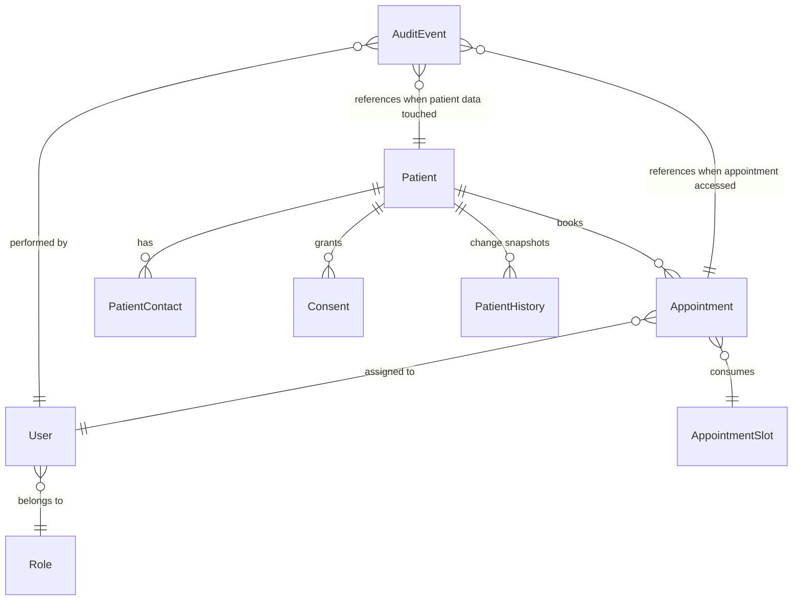
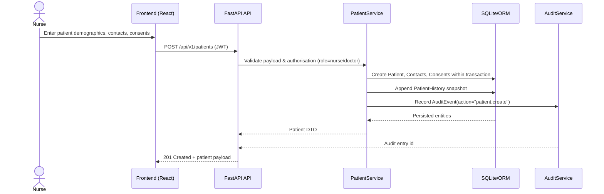
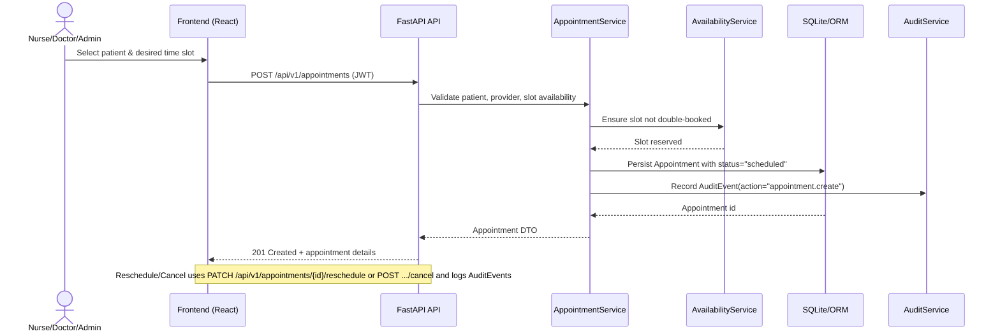

# Architecture Overview

This document summarizes the initial architecture for the Patient Information System MVP using the CSV specification (`specs/patient_system_requirements.csv`) as the single source of truth.

## Requirement Context

Functional focus areas and their key requirements:

- **Patient registration and maintenance** — `F-REG`
  - `REQ-F-REG-001` Potilaan perustietojen rekisteröinti
  - `REQ-F-REG-002` Potilaan tietojen muokkaus ja historiat
  - `REQ-F-REG-003` Suostumusten hallinta
  - `REQ-F-REG-004` Yhteyshenkilöt ja alaikäisen huoltajat
  - `REQ-F-REG-005` Potilaan poistaminen ja arkistointi
- **Appointment management** — `F-APPT`
  - `REQ-F-APPT-001` Ajanvaraus kalenterista
  - `REQ-F-APPT-003` Peruutukset ja uudelleenajoitus
- **Administration and access control** — `F-ADMIN`
  - `REQ-F-ADM-001` Roolit ja oikeudet
- **Security and audit trail** — `F-SEC`, `F-LEGAL`
  - `REQ-NF-SEC-001` Käyttäjätunnistus ja istunnot
  - `REQ-NF-SEC-002` Käyttöoikeusrajaukset tietotasolla
  - `REQ-NF-SEC-003` Lokitus ja auditointi
  - `REQ-NF-LEGAL-001` Tietosuojaperiaatteet ja minimointi
  - `REQ-NF-LEGAL-002` Oikeus tulla unohdetuksi (arkistointi)
- **Technical baseline** — `F-ARCH`
  - `REQ-NF-ARCH-001` Teknologiapino – kevyt paikallisasennus
  - `REQ-NF-ARCH-004` Tietomalli ja skeemat

## Component Architecture

The solution is split into independently testable layers to keep the system lightweight and locally runnable.

- **Frontend (React + Vite + TypeScript + Tailwind)**: Implements role-specific UI flows for patient registration, appointment scheduling, audit review, and authentication. Communicates exclusively through the REST API.
- **Backend API (FastAPI + SQLModel)**: Hosts the HTTP interface, request validation, and OpenAPI metadata. Routes delegate to service layer functions.
- **Service Layer**: Encapsulates domain logic such as patient lifecycle management, appointment rules (reschedule, cancel), audit creation, and permission checks.
- **Persistence Layer (SQLite via SQLModel/SQLAlchemy)**: Defines ORM models and migrations. Provides repository-style abstractions to the service layer.
- **Auth & Security Module**: Manages user accounts, password hashing, JWT creation/refresh (`REQ-NF-SEC-001`), and role-based authorization (`REQ-NF-SEC-002`).
- **Audit Logging Module**: Records every read or mutation of patient-related entities (`REQ-NF-SEC-003`) and exposes filters for compliance review. Stores immutable AuditEvent rows linked to the resource and actor.
- **Background Tasks (optional)**: Lightweight scheduler for cleanup (e.g., archiving), kept minimal to preserve local deployability (`REQ-NF-ARCH-001`).

### Deployment Topology

All components run on a single workstation. The backend exposes HTTP on `localhost`, the frontend runs in a separate dev server during development, and both share the SQLite database file. No external dependencies are required to satisfy `REQ-NF-ARCH-001`.

## Domain Model

### Entities

| Entity | Key Attributes | Description |
| --- | --- | --- |
| Patient | `id`, `identifier`, `first_name`, `last_name`, `date_of_birth`, `sex`, `contact_info`, `status`, timestamps | Core patient record covering requirements `REQ-F-REG-001` and `REQ-F-REG-002`.
| PatientContact | `id`, `patient_id`, `name`, `relationship`, `phone`, `email`, `is_guardian` | Emergency contacts and guardians (`REQ-F-REG-004`).
| Consent | `id`, `patient_id`, `type`, `status`, `granted_at`, `revoked_at`, `notes` | Captures patient consents and their history (`REQ-F-REG-003`).
| PatientHistory | `id`, `patient_id`, `changed_by`, `change_type`, `snapshot`, `changed_at` | Immutable change log for patient updates to meet audit and history expectations (`REQ-F-REG-002`, `REQ-NF-SEC-003`).
| Appointment | `id`, `patient_id`, `provider_id`, `location`, `service_type`, `start_time`, `end_time`, `status`, `notes`, `created_by` | Satisfies scheduling and rescheduling requirements (`REQ-F-APPT-001`, `REQ-F-APPT-003`).
| AppointmentSlot | `id`, `provider_id`, `start_time`, `end_time`, `capacity`, `status` | Optional representation of bookable time slots for resource management.
| User | `id`, `username`, `password_hash`, `display_name`, `role_id`, `is_active` | Clinical or admin users (`REQ-F-ADM-001`).
| Role | `id`, `code`, `name`, `permissions` | Role definitions for doctor, nurse, admin.
| AuditEvent | `id`, `actor_id`, `action`, `resource_type`, `resource_id`, `timestamp`, `metadata`, `context` | Captures every read/write of patient data (`REQ-NF-SEC-003`).
| TokenBlacklist (optional) | `id`, `jti`, `expires_at` | Allows future revocation of refresh tokens if required.

### Relationships

- Patient removal (`REQ-F-REG-005`) triggers archival flags rather than hard deletes to respect `REQ-NF-LEGAL-002`.
- Appointment lifecycle transitions (`scheduled → confirmed → completed`, `scheduled → cancelled`, `scheduled → rescheduled`) are tracked with timestamps and create AuditEvent records.
- AuditEvent metadata stores request context (user agent, IP, role) while excluding sensitive payload fields to comply with `REQ-NF-LEGAL-001`.

## Sequence Diagrams

### Register Patient (`REQ-F-REG-001`, `REQ-F-REG-002`, `REQ-F-REG-003`, `REQ-NF-SEC-003`)

### Book Appointment (`REQ-F-APPT-001`, `REQ-F-APPT-003`, `REQ-NF-SEC-003`)

## Compliance & Extensibility Considerations

- **Role enforcement**: Backend routes check JWT claims for doctor, nurse, or admin roles before granting access (`REQ-F-ADM-001`, `REQ-NF-SEC-002`).
- **Audit coverage**: Service layer automatically records read/write access to patient-linked resources (`REQ-NF-SEC-003`).
- **Privacy by design**: Data minimisation is achieved by storing only necessary PII and enabling selective archival (`REQ-NF-LEGAL-001`, `REQ-NF-LEGAL-002`).
- **Local-first install**: All dependencies remain local-friendly and run via simple commands (`REQ-NF-ARCH-001`). Future migrations to PostgreSQL are facilitated by SQLModel compatibility.
